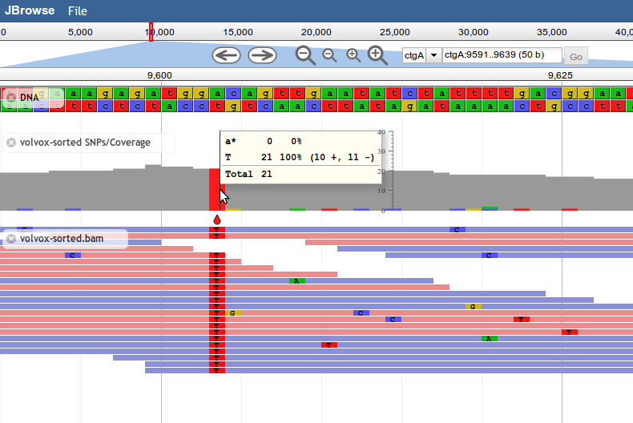
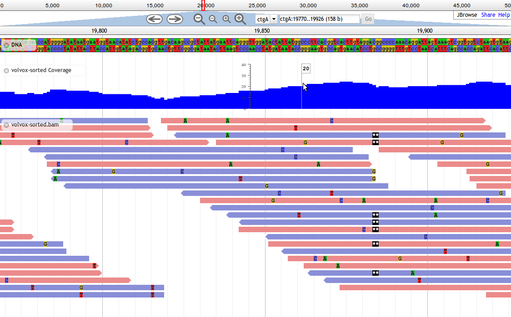

# Alignment Tracks (BAM and CRAM)

JBrowse has several track types that are designed for displaying alignment data,
particularly from BAM and CRAM files. BAM and CRAM files used with JBrowse must
be compressed and sorted by leftmost coordinate.

The JBrowse BAM parsing library makes extensive use of code from
[BioDalliance](http://www.biodalliance.org/), while the CRAM support is based on
the `@gmod/cram` npm module.

## Alignments2

Introduced in JBrowse 1.8.0, `Alignments2` tracks are designed to display
alignment data, such as from BAM files. This track type shows basepair-level
mismatches, insertions, deletions, and skipped regions between aligned reads and
the reference, and highlights paired reads in red if their mates are missing.

Base mismatches are displayed based on the contents of the feature's `MD` field
(containing a BAM MD mismatch string), and/or `CIGAR` field. If your BAM file
does not contain MD tags, one common way to generate them is with the
`samtools calmd` command.

`Alignments2` is a faster implementation of the older `Alignments` track type
that draws alignments using the HTML5 canvas. In the interest of speed,
`Alignments2` tracks do not display any text labels or descriptions alongside
features, and do not draw arrowheads indicating strandedness, instead relying on
color to denote the strand of alignments.

`Alignments2` tracks support the same advanced clicking behavior as
CanvasFeatures tracks, but does not support right-click menus.

The most basic Alignments2 track configuration in tracks.conf format is

[tracks.alignments] urlTemplate=FM.01.new.sorted.chr11.bam type=Alignments2

The above track template infers that the storeClass is a BAM store. Not all
track and store types can do this inference but Alignments2 allows this

## Paired read options

In JBrowse 1.16, paired read visualization was introduced

See [paired read configuration also](paired_reads.html) for more information

## List of configuration options

### General options

| Option                     | Value                                                                                                                                                                                                                                                                                                                                                         |
| -------------------------- | ------------------------------------------------------------------------------------------------------------------------------------------------------------------------------------------------------------------------------------------------------------------------------------------------------------------------------------------------------------- |
| `maxHeight`                | Available in JBrowse 1.9.0 and later. Maximum displayed height of the track in pixels. Defaults to 1000. Features that would cause the track to grow taller than the `maxHeight` are not shown. If a section of a track has features that are not drawn because of a `maxHeight` constraint, a notification is displayed at the bottom of that track section. |
| `style→color`              | HTML-style color for drawn alignments. By default, this varies with the alignment's strandedness, and whether its mate pair is missing, using the `style→color_fwd_strand`, `style→color_rev_strand`, and `style→color_missing_mate` variables. To gain complete control over the displayed color, you could set this to be a function callback.              |
| `style→color_fwd_strand`   | HTML-style color for alignments on the forward strand. Default \#EC8B8B, which is a light red.                                                                                                                                                                                                                                                                |
| `style→color_rev_strand`   | HTML-style color for alignments on the reverse strand. Default \#898FD8, which is a light blue.                                                                                                                                                                                                                                                               |
| `style→color_missing_mate` | HTML-style color for alignments with a missing mate. Default \#D11919, which is a dark red.                                                                                                                                                                                                                                                                   |
| `style→height`             | Height in pixels of each alignment. Default 7.                                                                                                                                                                                                                                                                                                                |
| `style→marginBotton`       | Number of pixels of vertical spacing to put on the bottom of each alignment. Default 1.                                                                                                                                                                                                                                                                       |
| `style→showMismatches`     | If true, draw mismatches (SNPs, insertions, deletions, skips) on the alignent. Default true.                                                                                                                                                                                                                                                                  |
| `style→mismatchFont`       | CSS string describing the font to use for labeling mismatches. Default "bold 10px Courier New,monospace".                                                                                                                                                                                                                                                     |

### Histograms configuration

A pre-defined histogram e.g. from a bigwig can be defined on the Alignments2
track. Example

```
[tracks.bam]
urlTemplate=alignments.bam
histograms.storeClass=JBrowse/Store/SeqFeature/BigWig
histograms.urlTemplate=coverage.bw
```

Config options

| Option                    | Value                                                                                                                                                                                               |
| ------------------------- | --------------------------------------------------------------------------------------------------------------------------------------------------------------------------------------------------- |
| `histograms.storeClass`   | A store class for summary histograms used for the Alignments2 track. Usually JBrowse/Store/SeqFeature/BigWig. Can be used on any CanvasFeatures-type track but generally used in Alignments2 tracks |
| `histograms.urlTemplate`  | Path to a histogram file (such as a BigWig) to be used for summary histograms used for the Alignments2 track. Can be used on any CanvasFeatures-type track but generally used in Alignments2 tracks |
| `histograms.color`        | Color for the histograms e.g. "purple". Default is orange. Can be used on any CanvasFeatures-type track but generally used in Alignments2 tracks                                                    |
| `histograms.binsPerBlock` | "Granularity" of the bins in histogram. Default is 200 for Alignments2 tracks. Default is 25 on other CanvasFeatures type tracks.                                                                   |

### Filtering options

Alignments can be filtered by various BAM flags

| Option                 | Value                                                                               |
| ---------------------- | ----------------------------------------------------------------------------------- |
| `hideDuplicateReads`   | Hide duplicate reads to the same location. Default: true                            |
| `hideQCFailingReads`   | Hide QC failing reads that did not pass some aligner quality. Default: true         |
| `hideSecondary`        | Hide secondary reads which mapped to multiple locations. Default: true              |
| `hideUnmapped`         | Hide unmapped reads. Default: true                                                  |
| `hideMissingMatepairs` | If a read is missing a mate pair or paired-end match, hide the read. Default: false |
| `hideImproperPairs`    | If a read is missing a mate pair or paired-end match, hide the read. Default: false |
| `hideForwardStrand`    | Hide all reads from the forward strand. Default: false                              |
| `hideReverseStrand`    | Hide all reads from the reverse strand. Default: false                              |

Note: `hideImproperPairs` was introduced in 1.16.0 to disambiguate from
hideMissingMatepairs. The "read mapped in proper pair" flag can have a mate but
it is simply classified as a bad alignment by the aligner, JBrowse displays
these as lightly colored

### Coloring options

| Option                      | Value                                                                                                                                                                                          |
| --------------------------- | ---------------------------------------------------------------------------------------------------------------------------------------------------------------------------------------------- |
| `useReverseTemplate`        | Use an algorithm for reversing the template of paired-end reads so that they appear on the same strand, RNA-seq specific. Default: false. Added in 1.11.6                                      |
| `useXS`                     | Color reads when the XS or TS tag which infers strandedness of RNA-seq spliced alignments that cross a splice junction. Default: false. Added in 1.11.6, added upper case TS support in 1.16.9 |
| `useTS`                     | Color reads using the lower case `ts` tag used by minimap2, indicates strandedness, RNA-seq specific. Default: false. Added in 1.16.0                                                          |
| `colorByMAPQ`               | Color reads according to mapping quality, RNA-seq specific. Default: false. Added in 1.16.0                                                                                                    |
| `colorByOrientation`        | Colors reads according to paired end orientations. Default: false. Added in 1.16.0                                                                                                             |
| `colorBySize`               | Colors reads according to insert size. Default: false. Added in 1.16.0                                                                                                                         |
| `colorByOrientationAndSize` | Colors reads according to paired end orientations. Default: false. Added in 1.16.0                                                                                                             |

Note: `colorBySize`, `colorByOrientationAndSize` invoke insert size stats
estimation, and only makes sense with paired read tracks. Many of these options
are 1.16.0 and newer. See [paired reads](paired_reads.html) for more
information.

### Other options

| Option                  | Value                                                                                                                                                                                                                                                 |
| ----------------------- | ----------------------------------------------------------------------------------------------------------------------------------------------------------------------------------------------------------------------------------------------------- |
| `cacheMismatches`       | Cache mismatch calculations so that long reads are faster to browser. Default: false. Added in 1.12.3                                                                                                                                                 |
| `renderAlignment`       | Add a text display of the BAM alignment on a single line in the View details popup. Default: false                                                                                                                                                    |
| `renderPrettyAlignment` | Add a text display of the BAM alignment using prettier "BLAST style" to the View details popup. Default: false                                                                                                                                        |
| `orientationType`       | Set the orientation pattern. Default is 'fr' according to illumina adapters that face each other. Other options are 'rf' and 'ff'. See https://software.broadinstitute.org/software/igv/interpreting_pair_orientations for more info. Added in 1.16.0 |

# Alignments2 coloring schemes

Since JBrowse 1.11.3, there is a new coloring scheme for BAM files that allows
for new coloring of paired end reads, such as a different coloring for unpaired
reads and aberrant pairing split across chromosomes.

The coloring styles that can be configured for the Alignments2 track are as
follows

| Option                              |
| ----------------------------------- | ------------------------------ |
| `style→color_fwd_strand`            | #EC8B8B (original red)         |
| `style→color_rev_strand`            | #8F8FD8 (original blue)        |
| `style→color_fwd_missing_mate`      | #D11919 (hard red)             |
| `style→color_rev_missing_mate`      | #1919D1 (hard blue)            |
| `style→color_fwd_strand_not_proper` | #ECC8C8 (light red)            |
| `style→color_rev_strand_not_proper` | #BEBED8 (light blue)           |
| `style→color_fwd_diff_chr`          | #000000 (black)                |
| `style→color_rev_diff_chr`          | #969696 (gray)                 |
| `style→color_nostrand`              | #999999 (gray) Added in 1.11.6 |

If this scheme is undesirable, the style-\>color variable can be overridden
entirely as well, with a callback for example. Also see See
[paired reads](paired_reads.html) for additional flags relavant to paired end
reads.

## SNPCoverage

Introduced in JBrowse 1.8.0, `SNPCoverage` tracks draw the coverage of alignment
features along the genome, along with a graphical representation of
base-mismatch (possible SNP) distribution, and tables showing frequencies for
each mismatching base.

Like the other alignment tracks, base mismatches are displayed based on the
contents of the feature's `MD` field (containing a BAM MD mismatch string).

**Note: Since the SNPCoverage track dynamically calculates coverage and putative
SNPs directly from alignment data, it is not recommended for use with very dense
feature data, such as deep-coverage BAM files.** For these types of files, it's
recommended to pre-generate a BigWig file of the coverage and a VCF file of
putative SNPs, and display those instead.



### Example SNPCoverage Configuration

In your data/tracks.conf file:

```
[tracks.my-bam-coverage-track]
storeClass = JBrowse/Store/SeqFeature/BAM
urlTemplate = volvox-sorted.bam
type = JBrowse/View/Track/SNPCoverage
metadata.Description = SNP/Coverage view of volvox-sorted.bam, simulated resequencing alignments.
key = BAM - volvox-sorted SNPs/Coverage
```

Note that `urlTemplate` will refer to a file relative to the "data" directory
that you are using.

## Alignments

Introduced in JBrowse 1.7.0, `Alignments` tracks are an HTML-based track type
for alignment display. They display everything that `Alignments2` do, and also
can be configured with right-click menus and strand arrowheads.

They display everything that `Alignments2` tracks do, plus they support the same
configuration options as feature tracks, including advanced clicking behavior,
feature modification callbacks, and so forth. The price of this additional
capability is that `Alignments` tracks are **significantly slower** when used
with dense data such as deep BAM alignments.

`Alignments2` is recommended over `Alignments` for most users.



## BAM Data Configuration Options

| Option           | Value                                                                                                                                                                                                                                                                          |
| ---------------- | ------------------------------------------------------------------------------------------------------------------------------------------------------------------------------------------------------------------------------------------------------------------------------ |
| `urlTemplate`    | URL for the BAM file to display.                                                                                                                                                                                                                                               |
| `baiUrlTemplate` | URL for the corresponding BAM index (BAI) file. If not set, this is assumed to be the same URL as `urlTemplate` with `.bai` appended.                                                                                                                                          |
| `csiUrlTemplate` | URL for the corresponding BAM index (CSI) file. Must be set manually in the case that it is being used.                                                                                                                                                                        |
| `chunkSizeLimit` | Maximum size in bytes of BAM chunks that the browser will try to deal with. Default 5000000 (5 MiB). When this is exceeded, most tracks will display some kind of "Too much data" message. If you increase this, be careful. You could blow up your web browser.               |
| `fetchSizeLimit` | Maximum size in bytes of a single BAM request that the browser will try to deal with. Default 100000000 (100 MiB). When this is exceeded, most tracks will display some kind of "Too much data" message. If you increase this, be careful. You could blow up your web browser. |

`Note: you can also increase maxFeatureScreenDensity if you get the "Too much data to show; zoom in to see detail".`

## Example BAM Alignments2 track configuration

```{.javascript}
      {
         "storeClass"  : "JBrowse/Store/SeqFeature/BAM",
         "urlTemplate" : "../../raw/volvox/volvox-sorted.bam",
         "label"       : "volvox-sorted.bam",
         "type"        : "JBrowse/View/Track/Alignments2"
      },

```

## Apache Configuration Note

If you are using the Apache web server, please be aware that the module
`mime_magic` can cause BAM files to be served incorrectly. Usually, the error in
the web developer console will be something like "Not a BAM file". Some packaged
versions of Apache, particularly on Red Hat or CentOS-based systems, are
configured with this module turned on by default. We recommend you deactivate
this Apache module for the server or directory used to serve JBrowse files. If
you do not want to deactivate this module for the entire server, try adding this
line to your HTTPD config or .htaccess file:

`AddType application/octet-stream .bam .bami .bai`

In some cases the problem can also manifest in VCF tabix for example, you may
also need to use

    AddType application/octet-stream .gz
    AddType application/octet-stream .tbi
    AddEncoding dummy .gz .tbi

Note that there may be some sideeffect related to downloading gz files from
this, but it has been reported to fix jbrowse usage of tabix VCF. Let us know if
you have other solutions
