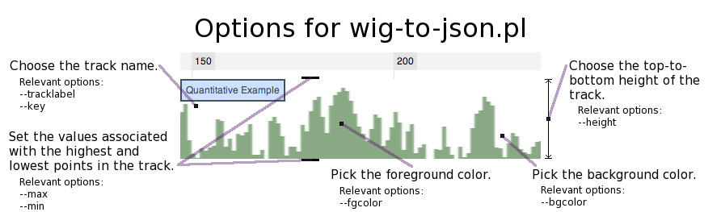
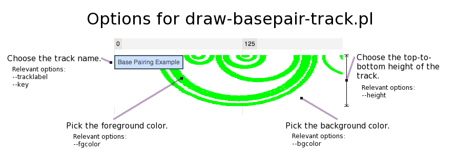

# Pre-rendered Image Tracks

JBrowse supports tracks based on pre-generated PNG or JPEG images that are tiled
along the reference sequence. Currently, JBrowse ships with two different image
track generators: [wig-to-json.pl](#wig-to-jsonpl 'wikilink'), which generates
images showing simple quantitative (wiggle) data, and
[draw-basepair-track.pl](#draw-basepair-trackpl 'wikilink'), which draws arcs to
show the base pairing structure of RNAs.

## wig-to-json.pl

---

Using a [wiggle](http://genome.ucsc.edu/goldenPath/help/wiggle.html) file, this
script creates a single Image track that displays data from the wiggle file.
**Beginning with JBrowse 1.5, this is no longer the recommended method of
displaying wiggle data: it has largely been replaced by the direct-access BigWig
data store coupled with the next-generation Wiggle track type. See
[Wiggle Tracks](</#Wiggle/BigWig_Tracks_(XYPlot,_Density)> 'wikilink').**

In wiggle data, a numeric value is associated with each nucleotide position in
the reference sequence. This is represented in JBrowse as a track that looks
like a histogram, where the horizontal axis is for each nucleotide position, and
the vertical axis is for the number associated with that position. The vertical
axis currently does not have a scale; rather, the heights for each position are
relative to each other.

Special dependencies: [libpng](http://www.libpng.org/pub/png/libpng.html)

In order to use wig-to-json.pl, the code for wig2png must be compiled. Normally,
this is done automatically by `setup.sh` but it can be done manually if
necessary. See the Quick Start Tutorial packaged with JBrowse for details.

### Basic usage

`bin/wig-to-json.pl --wig <wig file> --tracklabel <track name> [options]`

Hint: If you are using this type of track to plot a measure of a prediction's
quality, where the range of possible quality scores is from some lowerbound to
some upperbound (for instance, between 0 and 1), you can specify these bounds
with the max and min options.

| Option     | Value                                                                                                                                                                           |
| ---------- | ------------------------------------------------------------------------------------------------------------------------------------------------------------------------------- |
| wig        | The name of the wig file that will be used. This option must be specified.                                                                                                      |
| tracklabel | The internal name that JBrowse will give to this feature track. This option requires a value.                                                                                   |
| key        | The external, human-readable label seen on the feature track when it is viewed in JBrowse. The value of key defaults to the value of tracklabel.                                |
| out        | A path to the output directory (default is 'data' in the current directory).                                                                                                    |
| tile       | The directory where the tiles, or images corresponding to each zoom level of the track, are stored. Defaults to data/tiles.                                                     |
| bgcolor    | The color of the track background. Specified as "RED,GREEN,BLUE" in base ten numbers between 0 and 255. Defaults to "255,255,255".                                              |
| fgcolor    | The color of the track foreground (i.e. the vertical bars of the wiggle track). Specified as "RED,GREEN,BLUE" in base ten numbers between 0 and 255. Defaults to "105,155,111". |
| width      | The width in pixels of each tile. The default value is 2000.                                                                                                                    |
| height     | The height in pixels of each tile. Changing this parameter will cause a corresponding change in the top-to-bottom height of the track in JBrowse. The default value is 100.     |
| min        | The lowerbound to use for the track. By default, this is the lowest value in the wiggle file.                                                                                   |
| max        | The upperbound to use for the track. By default, this will be the highest value in the wiggle file.                                                                             |

### System-specific tips for building wig2png

#### Apple OS X

You need libpng and a C++ compiler; you can get these with
[Homebrew](http://mxcl.github.com/homebrew/),
[MacPorts](http://www.macports.org/), or [Fink](http://www.finkproject.org/).

Once you have those installed, you need to compile the JBrowse wiggle-processing
program. JBrowse includes a makefile to do this, but you may need to add the
paths for `libpng` and `png.h` to your compiler's library and include paths. For
example, if libpng is in `/usr/X11`, you can run `configure` like this:

`./configure CXXFLAGS=-I/usr/X11/include LDFLAGS=-L/usr/X11/lib`

Depending on which OS X you have (and whether you're using MacPorts/fink/etc.),
libpng might be somewhere other than `/usr/X11`, like `/opt/local` for example.
To find where libpng is, try `locate libpng`.

#### Ubuntu / Debian Linux

Be sure to install the `libpng\#\#` and `libpng\#\#-dev` packages, where `\#\#`
is a number such as 12 or 15, depending on the version of Ubuntu.

#### Red Hat/CentOS/Fedora Linux

Be sure to install the `libpng` and `libpng-devel` packages.

# # draw-basepair-track.pl

This script inputs a single base pairing track into JBrowse. A base pairing
track is a distinctive track type that represents base pairing between
nucleotides as arcs. In addition, it is intended to demonstrate the Perl API for
writing your own image track generators.

### Basic usage

`bin/draw-basepair-track.pl --gff <gff file> --tracklabel <track name> [options]`

| Option     | Value                                                                                                                                                                       |
| ---------- | --------------------------------------------------------------------------------------------------------------------------------------------------------------------------- |
| gff        | The name of the gff file that will be used. This option must be specified.                                                                                                  |
| tracklabel | The internal name that JBrowse will give to this feature track. This option requires a value.                                                                               |
| key        | The external, human-readable label seen on the feature track when it is viewed in JBrowse. The value of key defaults to the value of tracklabel.                            |
| out        | A path to the output directory (default is 'data' in the current directory).                                                                                                |
| tile       | The directory where the tiles, or images corresponding to each zoom level of the track, are stored. Defaults to data/tiles.                                                 |
| bgcolor    | The color of the track background. Specified as "RED,GREEN,BLUE" in base ten numbers between 0 and 255. Defaults to "255,255,255".                                          |
| fgcolor    | The color of the track foreground (i.e. the base pairing arcs). Specified as "RED,GREEN,BLUE" in base ten numbers between 0 and 255. Defaults to "0,255,0".                 |
| width      | The width in pixels of each tile. The default value is 2000.                                                                                                                |
| height     | The height in pixels of each tile. Changing this parameter will cause a corresponding change in the top-to-bottom height of the track in JBrowse. The default value is 100. |
| thickness  | The thickness of the base pairing arcs in the track. The default value is 2.                                                                                                |
| nolinks    | Disables use of file system links to compress duplicate image files.                                                                                                        |
