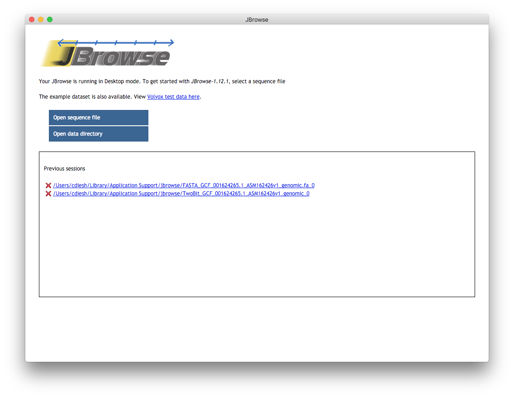

This page provides a reference guide for "Desktop JBrowse" or "JBrowse Desktop",
which is a [electron application](https://electron.atom.io) that was unveiled
for the release of JBrowse 1.12.0.

The operation of JBrowse Desktop is comparable to other desktop genome browsers
like IGV or IGB, and it can be run without setting up a webserver (most of the
time normal jbrowse runs on apache and is viewed in a web browser). In contrast,
JBrowse Desktop is a simple exe file that can easily be run locally on Windows,
Mac OS, or Linux.

## Installation

At the most basic level, to set up JBrowse Desktop:

- Download a zip file script from jbrowse.org e.g. from the latest release at
  <http://jbrowse.org/blog/>. Linux, Windows, and Darwin variants are available
  as `JBrowse-1.15.4-desktop-<system>-x64.zip`.
- After downloading, unzip the file to somewhere. There is no official installer
  but you can move it to the Program files or Applications directory as needed.

Note: on Mac, you can alternatively use Homebrew and run \`brew cask install
jbrowse\` which will download and place jbrowse in your Application directory

Also note: On Linux, you will need libgconf

    sudo apt install libgconf-2-4

See this thread for details https://github.com/electron/electron/issues/1518

## Overview of JBrowse Desktop

When you run JBrowse Desktop you will see a sort of "welcome screen" that gives
you several options

- View Volvox sample data
- Open sequence file, this allows you to open FASTA, Indexed FASTA, or .2bit
- Open data directory, this allows you to open a data directory that has been
  prepared with normal jbrowse tools

Note: it is highly recommended to use Indexed FASTA (selecting both a fasta and
a fai file generated by \`samtools faidx file.fasta\`) or 2bit. Even small
genomes with normal FASTA will be much slower\!

## Screenshot

This is the welcome page when you open up the jbrowse app. You can open up
sequence files such as fasta, 2bit, or indexed fasta here. Or, you can open up a
pre-existing jbrowse data directory. You can also see a list of past "sessions"
which can be revisited later. The red warning is sort of awkward but it does not
have any meaning here, it just means that you aren't currently in jbrowse main
screen

## Limitations

- The "Save session" function will not save some configuration customizations,
  so if you have advanced customizations it would be recommended to make a data
  directory by hand the trackList.json and tracks.conf format files
- If you open a data directory on the web, then "Save session" won't work

## Features

- Can open files from shared network folders and external hard drives on both
  windows and mac
- Can open files from remote URLs
- Can open data directories from remote URL
- Saves "sessions" to the OS "application data" folders
- Has a "home screen" that lists previous sessions

## Technical details

The folder where sessions are saved is generally

- OSX - "~/Library/Application Support/jbrowse"
- Windows - "C:\\Users\\username\\AppData\\Roaming\\jbrowse"

## Tested platforms

- OSX Mavericks
- macOS sierra
- Windows 7
- Windows 10

Note: JBrowse Desktop doesn't work on windows XP and Vista (in fact all electron
apps require Windows 7+)

# External Links

- [JBrowse: a dynamic web platform for genome visualization and analysis](https://genomebiology.biomedcentral.com/articles/10.1186/s13059-016-0924-1)
  paper
