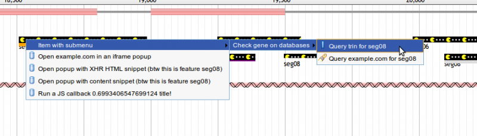
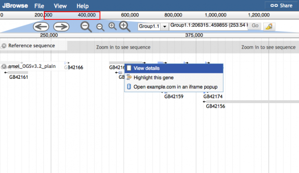

## Customizing parts of the 'View details' Pop-ups with callbacks

Starting in JBrowse version 1.11.3, the ability to customize parts of the 'View
details' Pop-ups was added. This lets you specify functions that have the format
fmtDetailValue*\* or fmtDetailField*\* to either change the value section of an
attribute in the config, or the fieldname of an attribute in the config.

Here is an example in tracks.conf format for formatting the "Name" field by
adding a link to it:

```
[tracks.mygff]
key = My Gene Track
storeClass = JBrowse/Store/SeqFeature/NCList
type = FeatureTrack
fmtDetailValue_Name = function(name) {
   return "<a href='http://www.example.com?featurename="+name+"'>"+name+"</a>";
 }
```

Note: It is also easy to specify these methods in trackList.json format.

```
{
 "key": "My Gene Track",
 "storeClass" : "JBrowse/Store/SeqFeature/NCList",
 "type" : "FeatureTrack",
 "label": "mygff",
 "fmtDetailValue_Name": "function(name) { return '<a href=\"http://www.example.com?featurename='+name+'\">'+name+'</a>'; }"
}
```

Addendum: If the field has multiple values (e.g. multiple DBXrefs or GO terms),
then the callback will receive an array as it's argument, and then you can also
return an array which indicates that each element will be formatted inside its
own \<div\>. In this case you will check that the input is an array, because it
will also be called on the individual elements too. For example:

```
 "fmtDetailValue_links": "function(links) { if(Array.isArray(links)) { return links; } else return `<a href=\"${link}\">${link}</a>`; }"
```

This shows that you could, in essence, pre-process the array if you wanted, but
the same callback is then called on the individual elements, so you handle both
these cases.

### Rendering HTML in popups

If you are using the fmtDetailValue callbacks it is assumed that HTML can be
returned. Otherwise if your data contains actual HTML that you want to render
you must set `unsafePopup` on your track

### Additional customizations to the pop-up boxes

In JBrowse 1.11.5, some additional customizations to the pop-up boxes were
added.

1. The ability to access the feature data was added to the callback signature of
   the fmtDetailValue\_\* functions. Example:

```
fmtDetailValue_Name = function(name, feature) {
    /* only add links to the top-level feature */
    if(feature.get('type')=='mRNA') {
        return name + ' [<a href=http://www.ncbi.nlm.nih.gov/gquery/?term='+name+'>Search NCBI</a>]';
    }
  }
```

2. The ability to customize the 'About track' popups was added. These callbacks
   are named fmtMetaValue\_\* and fmtMetaField\_\*

3. The ability to customize mouseover descriptions of the fieldnames was also
   added. These callbacks are named fmtDetailDescription\_\* and
   fmtMetaDescription\_\*

4. The ability to remove a field from the popup was added. You can do this by
   returning null from a fmtDetailField\_\* and fmtMetaField\_\* callback;

5. In 1.15.4 the ability to remove the sequence FASTA boxes from the View
   details popups was added by specifying hideSequenceBox: true to the config

# Customizing Left-click Behavior

Beginning with JBrowse 1.5.0, the left-clicking behavior of feature tracks (both
HTMLFeatures and CanvasFeatures) is highly configurable. To make something
happen when left-clicking features on a track, add an onClick option to the
feature track's configuration.

In the example configuration below, left-clicks on features will open an
embedded popup window showing the results of searching for that feature's name
in NCBI's global search, and "search at NCBI" will show in a tooltip when the
user hovers over a feature with the mouse:

Check out the new [JBrowse FAQ](faq.html) page for more tips on setup and config

Also see the [JBrowse Desktop](jbrowse_desktop.html) guide here.

# Feature Tracks (HTMLFeatures and CanvasFeatures)

Feature tracks can be used to visualize localized annotations on a sequence,
such as gene models, transcript alignments, SNPs and so forth.

## Generic Track Configuration Options

| Option                  | Description                                                                                                                                                                        |
| ----------------------- | ---------------------------------------------------------------------------------------------------------------------------------------------------------------------------------- |
| `subfeatureDetailLevel` | Set the level of detail of the View details box. If set to 1, only displays one level of subfeatures for example. Default: 0 which displays all subfeature levels. Added in 1.12.3 |

## Customizing parts of the 'View details' Pop-ups with callbacks

Starting in JBrowse version 1.11.3, the ability to customize parts of the 'View
details' Pop-ups was added. This lets you specify functions that have the format
fmtDetailValue*\* or fmtDetailField*\* to either change the value section of an
attribute in the config, or the fieldname of an attribute in the config.

Here is an example in tracks.conf format for formatting the "Name" field by
adding a link to it:

```
[tracks.mygff]
key = My Gene Track
storeClass = JBrowse/Store/SeqFeature/NCList
type = FeatureTrack
fmtDetailValue_Name = function(name) {
   return "<a href='http://www.example.com?featurename="+name+"'>"+name+"</a>";
 }
```

Note: It is also easy to specify these methods in trackList.json format.

```
{
 "key": "My Gene Track",
 "storeClass" : "JBrowse/Store/SeqFeature/NCList",
 "type" : "FeatureTrack",
 "label": "mygff",
 "fmtDetailValue_Name": "function(name) { return '<a href=\"http://www.example.com?featurename='+name+'\">'+name+'</a>'; }"
}
```

Addendum: If the field has multiple values (e.g. multiple DBXrefs or GO terms),
then the callback will receive an array as it's argument, and then you can also
return an array which indicates that each element will be formatted inside its
own \<div\>. In this case you will check that the input is an array, because it
will also be called on the individual elements too. For example:

```
 "fmtDetailValue_links": "function(links) { if(Array.isArray(links)) { return links; } else return `<a href=\"${link}\">${link}</a>`; }"
```

This shows that you could, in essence, pre-process the array if you wanted, but
the same callback is then called on the individual elements, so you handle both
these cases.

### Additional customizations to the pop-up boxes

In JBrowse 1.11.5, some additional customizations to the pop-up boxes were
added.

1. The ability to access the feature data was added to the callback signature of
   the fmtDetailValue\_\* functions. Example:

```
fmtDetailValue_Name = function(name, feature) {
    /* only add links to the top-level feature */
    if(feature.get('type')=='mRNA') {
        return name + ' [<a href=http://www.ncbi.nlm.nih.gov/gquery/?term='+name+'>Search NCBI</a>]';
    }
  }
```

2. The ability to customize the 'About track' popups was added. These callbacks
   are named fmtMetaValue\_\* and fmtMetaField\_\*

3. The ability to customize mouseover descriptions of the fieldnames was also
   added. These callbacks are named fmtDetailDescription\_\* and
   fmtMetaDescription\_\*

4. The ability to remove a field from the popup was added. You can do this by
   returning null from a fmtDetailField\_\* and fmtMetaField\_\* callback;

# Customizing Left-click Behavior

Beginning with JBrowse 1.5.0, the left-clicking behavior of feature tracks (both
HTMLFeatures and CanvasFeatures) is highly configurable. To make something
happen when left-clicking features on a track, add an onClick option to the
feature track's configuration.

In the example configuration below, left-clicks on features will open an
embedded popup window showing the results of searching for that feature's name
in NCBI's global search, and "search at NCBI" will show in a tooltip when the
user hovers over a feature with the mouse:

```
   "tracks": [
      {
         "label"    : "ReadingFrame",
         "category" : "Genes",
         "class"    : "dblhelix",
         "key"      : "Frame usage",
         "onClick"  : {
             "label": "search at NCBI",
             "url": "http://www.ncbi.nlm.nih.gov/gquery/?term={name}"
         }
      }
   ...
```

For details on all the options supported by **onClick**, see
[Click Configuration Options](#click-configuration-options 'wikilink').

Note: the style→linkTemplate variable can also be used to specify a URL for
left-click on features, but this is a legacy option.

# Customizing Mouse-over behavior

The onClick→label attribute from the
[previous section](#customizing-left-click-behavior 'wikilink') is used as the
mouse-over description for features on the HTMLFeatures and CanvasFeatures
tracks.

In JBrowse 1.11.6, the onClick→label attribute was extended further to allow the
mouse-over description to be customized using callbacks and template strings.

Example for CanvasFeatures, allows full HTML tooltips if you set
`unsafeMouseover`. Here the {name} template is automatically filled in with the
feature info:

```
    "onClick": {
        "label" : "<div style='font:normal 12px Univers,Helvetica,Arial,sans-serif'>Feature name: {name}</div>",
        "title" : "{name} {type}",
        "action": "defaultDialog"
    },
    "unsafeMouseover": true
```

Example for HTMLFeatures, which only allows plain text descriptions but can
support newlines (essentially uses \<div title="..."\> for mouseover).

```
    "onClick": {
        "label": "Feature name {name}\nFeature start {start}\nFeature end {end}",
        "title" : "{name} {type}",
        "action": "defaultDialog"
    }
```

Example using a callback (for either HMTLFeatures or CanvasFeatures), using
this.feature to access the feature details

```
    "onClick": {
        "label": "function() { return 'Feature name: '+this.feature.get('name'); }",
        "title" : "{name} {type}",
        "action": "defaultDialog"
    }
```

Note: on CanvasFeatures, the action "defaultDialog" isn't necessary, but it is
necessary for HTMLFeatures to keep the default dialog (as of writing, 1.11.6).

Also note: The "label" which is used in the text for mouseover will be used for
the title of any popup by default, so you might also specify a different title.

Also also note: Your mouseover will crash if your features do not have an ID or
name, even if you coded the mouseover to not use ID or name.

# Customizing Right-click Context Menus

Feature tracks can be configured to display a context menu of options when a
user right-clicks a feature item. Here is an example of a track configured with
a multi-level right-click context menu:

```
     {
        "feature" : [
           "match"
        ],
        "track" : "Alignments",
        "category" : "Alignments",
        "class" : "feature4",
        "key" : "Example alignments",
        "hooks": {
            "modify": "function( track, feature, div ) { div.style.height = (Math.random()*10+8)+'px';  div.style.backgroundColor = ['green','blue','red','orange','purple'][Math.round(Math.random()*5)];}"
        },
        "menuTemplate" : [
            {
              "label" : "Item with submenu",
              # hello this is a comment
              "children" : [
              {
                "label" : "Check gene on databases",
                "children" : [
                {
                  "label" : "Query trin for {name}",
                  "iconClass" : "dijitIconBookmark",
                  "action": "newWindow",
                  "url" : "http://wiki.trin.org.au/{name}-{start}-{end}"
                },
                {
                "label" : "Query example.com for {name}",
                "iconClass" : "dijitIconSearch",
                "url" : "http://example.com/{name}-{start}-{end}"
                }
                ]
              },
              { "label" : "2nd child of demo" },
              { "label" : "3rd child: this is a track" }
            ]
            },
            {
              "label" : "Open example.com in an iframe popup",
              "title" : "The magnificent example.com (feature {name})",
              "iconClass" : "dijitIconDatabase",
              "action": "iframeDialog",
              "url" : "http://www.example.com?featurename={name}"
            },
            {
              "label" : "Open popup with XHR HTML snippet (btw this is feature {name})",
              "title": "function(track,feature,div) { return 'Random XHR HTML '+Math.random()+' title!'; }",
              "iconClass" : "dijitIconDatabase",
              "action": "xhrDialog",
              "url" : "sample_data/test_snippet.html?featurename={name}:{start}-{end}"
            },
            {
              "label" : "Open popup with content snippet (btw this is feature {name})",
              "title": "function(track,feature,div) { return 'Random content snippet '+Math.random()+' title!'; }",
              "iconClass" : "dijitIconDatabase",
              "action": "contentDialog",
              "content" : "function(track,feature,div) { return '
 \<h2\>{name}\<\/h2\> This is some test content about feature {name}!  This message brought to you by the number \<span style=\"font-size: 300%\"\>'+Math.round(Math.random()\*100)+'\<\/span\>.
            },
            {
              "label" : "function(track,feature,div) { return 'Run a JS callback '+Math.random()+' title!'; }",
              "iconClass" : "dijitIconDatabase",
              "action": "function( evt ){ alert('Hi there! Ran the callback on feature '+this.feature.get('name')); }"
            },
            {
              "label": "Create a url with a callback",
              "action": "iframeDialog",
              "iconClass": "dijitIconDatabase",
              "title": "Create a url with a callback",
              "url": "function(track,feature) { return
                  'http://www.example.com?refseq='+track.refSeq.name
                  +'&featurename='+feature.get('name')+'&start='+feature.get('start')+'&end='+feature.get('end'); }"
             },
        ]
     }
```

This configuration results in a context menu like the one pictured below. For
details on what each of the options supported by menu items does, see
[Click Configuration Options](#click-configuration-options 'wikilink').



To add a separator, put the following item in your menuTemplate

    { type: 'dijit/MenuSeparator' }

Note that you can keep the default right-click menu items in JBrowse by just
setting "blank" placeholders in the menuTemplate.

```
    "menuTemplate" : [ 
         {   
          "label" : "View details",
        },  
        {   
          "label" : "Highlight this gene",
        },  
        {   
          "label" : "Open example.com in an iframe popup",
          "title" : "The magnificent example.com (feature{name})",
          "iconClass" : "dijitIconDatabase",
          "action": "iframeDialog",
          "url" : "http://www.example.com?featurename={name}"
        }   
    ]
```

Alternatively, if you are using tracks.conf format, you can build a menuTemplate
similar to the above configuration using the following:

```
    menuTemplate+=json:{"label": "View details"}
    menuTemplate+=json:{"label": "Highlight this gene"}
    menuTemplate+=json:{"label": "Open example.com in an iframe popup", "iconClass" : "dijitIconDatabase","action": "iframeDialog","url" : "http://www.example.com?featurename={name}"}
```

This results in a context menu like the one pictured below.



Note: You'll note in the above that "placeholder" menu items are put in place to
prevent the default "View details" from being overwritten. There are some
caveats with regards to these placeholder items. You can't rearrange them or
choose which ones you want. You can only overwrite them. Custom items will
overwrite the default ones one-by-one.

## Click Configuration Options

A click action (left-click on a feature or on an item in a context menu) can be
configured to do nearly anything. It can be configured with a string JavaScript
callback, like:

```
    "function( track, feature, featureDiv ) { alert('Run any JavaScript you want here!'); }"
```

Or a structure containing options like:

```
    {
       "iconClass" : "dijitIconDatabase",
       "action" : "iframeDialog",
       "url" : "http://www.ncbi.nlm.nih.gov/gquery/?term={name}",
       "label" : "Search for {name} at NCBI",
       "title" : "function(track,feature,div) { return 'Searching for '+feature.get('name')+' at NCBI'; }"
       // optional: "hideIframeDialogUrl": true
    }
```

The available options for a click action are:

- iconClass: Used only for click actions in context menus. Usually, you will
  want to specify one of the Dijit icon classes here. Although they are not well
  documented, a list of available icon classes can be seen at
  <https://github.com/dojo/dijit/blob/1.7.2/icons/commonIcons.css>.
- action: Either a JavaScript function to run in response to the click (e.g.
  "function(){..}"), or one of the following special strings:

- "iframeDialog" - the default - causes the given **url** to be opened in a
  popup dialog box within JBrowse, in an `iframe` element. special note: setting
  the track config `hideIframeDialogUrl` hides the URL link in the dialog title
- "newWindow" - causes the given **url** to be opened in a new browser window.
- "navigateTo" - added in JBrowse 1.10.8, opens the given **url** in the same
  browser window, navigating the user away from JBrowse.
- "contentDialog" - causes the JavaScript string or callback set in the
  **content** option to be displayed in the dialog box.
- "defaultDialog" - Performs the normal popup action. See
  [JBrowse_Configuration_Guide\#Customizing_Mouse-over_behavior](#customizing-mouse-over-behavior 'wikilink')
  for an example of when this is useful.
- "xhrDialog" - causes the given **url** to be opened in a popup dialog,
  containing the HTML fetched from the given **url** option. The difference
  between "iframeDialog" and "xhrDialog" is that an iframeDialog's URL should
  point to a complete web page, while an xhrDialog's URL should point to a URL
  on the same server (or that supports [CORS](http://gmod.org/wiki/CORS)) that
  contains just a snippet of HTML (not a complete web page). For those familiar
  with GBrowse, the xhrDialog is similar to GBrowse popup balloons that use a
  _url:..._ target, while the contentDialog is similar to a GBrowse popup
  balloon with a normal target. GBrowse does not have an equivalent of the
  iframeDialog.]
- "Javascript callback" - If you use a javascript callback for the action
  parameter, then the function signature will be function(clickEvent) { ... }
  and the clickEvent doesn't contain particularly useful info, but you can
  access the feature object using this.feature.get('name'); for example.
- content: string (interpolated with feature fields) or JS callback that returns
  either a string or (beginning in 1.10.0) a dojo/Deferred object that will
  resolve to a string. Used only by a contentDialog.
- url: URL used by newWindow, xhrDialog, or iframeDialog actions.
- label: descriptive label for the link. In a right-click context menu, this
  will be the text in the menu item. In a onClick section, it will be the
  mouse-over description too. See
  [JBrowse_Configuration_Guide\#Customizing_Mouse-over_behavior](#customizing-mouse-over-behavior 'wikilink')
  for details on the mouse-over behavior.
- title: title used for the popup window
