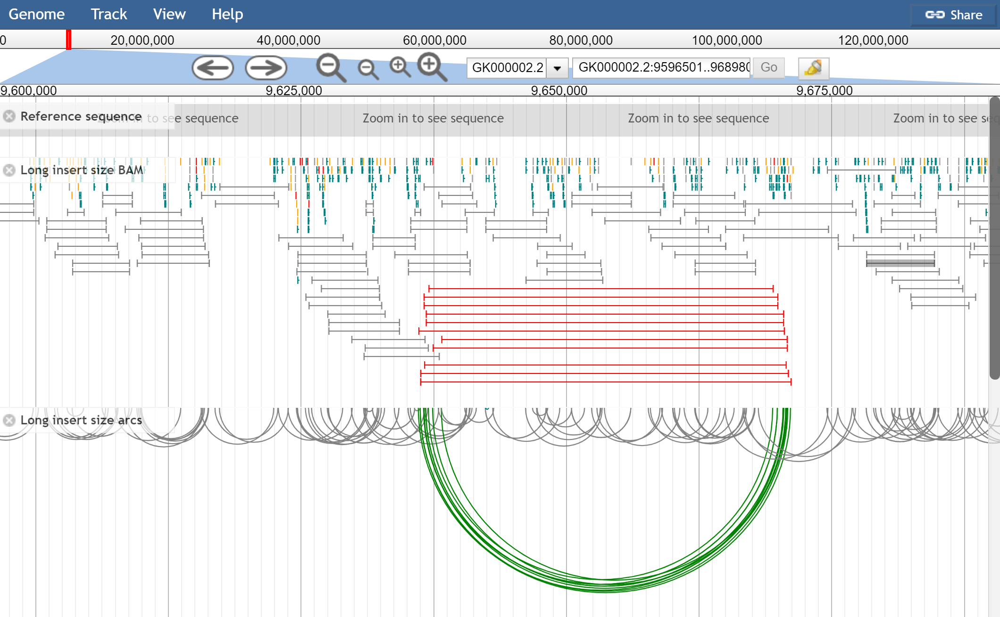
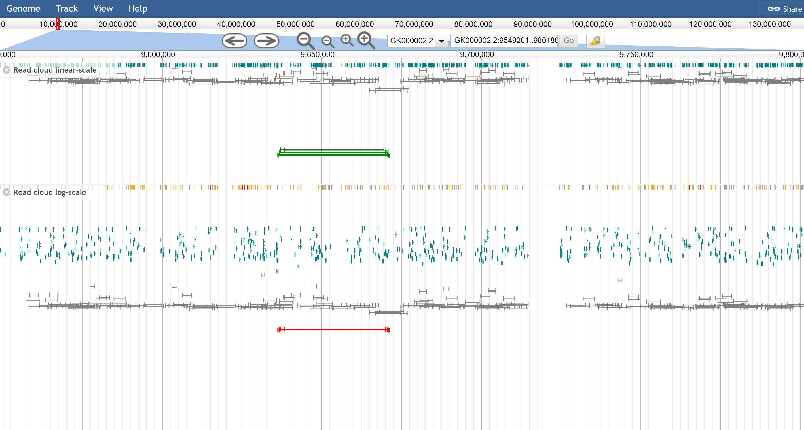
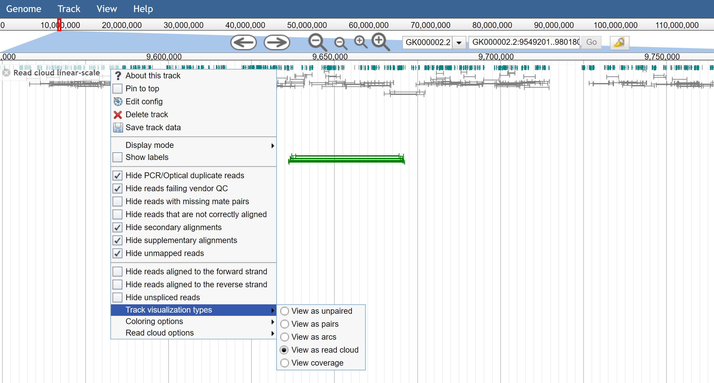
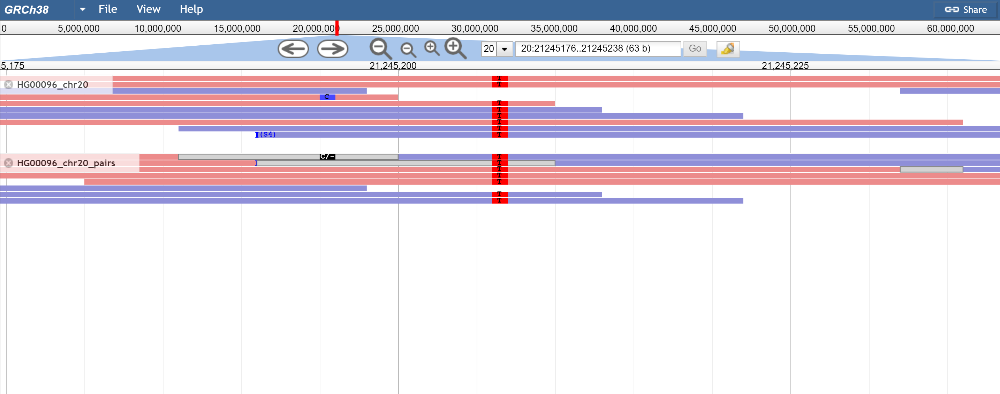

In JBrowse 1.16.0, paired read viewing was introduced to help visualize
alignments data. Paired reads are enabled on Alignments2 tracks. Note that this
incurs some high memory usage especially on high coverage data files so please
use carefully.

## Configuration

The paired read visualizations are enabled on Alignments2 track types. By
changing the glyph, you can enable the different paired visualizations on the
Alignments2 tracks

| Option                                      | Description                                                   |
| ------------------------------------------- | ------------------------------------------------------------- |
| `JBrowse/View/FeatureGlyph/PairedArc`       | This plots arcs connecting read pairs                         |
| `JBrowse/View/FeatureGlyph/PairedReadCloud` | This plots reads according to their insert size on the Y-axis |
| `JBrowse/View/FeatureGlyph/PairedAlignment` | This enables a pileup view of paired alignments               |

Note that the `PairedReadCloud` and `PairedAlignment` use a config parameter
`maxInsertSize` which only resolves read pairs within a specific insert size.
The default `maxInsertSize` is 50,000bp. For larger insert sizes, the
`PairedArc` track can be used, which is able to plot larger information. The
reason for this is the `PairedArc` view does not need to actually resolve both
reads, but can use information from one read to draw towards the other one. The
`PairedReadCloud` and `PairedAlignment` both need to resolve the read
information before it can be plotted.

## Algorithm explanation

For paired read pileup and read cloud views, a window of size `maxInsertSize`
needs to be fetched surrounding the current view in order to properly resolve
the pairs.

For the arc view, a window size corresponding to the current viewed window must
be fetched, but proper resolution of the read pairs is not needed.

The reason things can become complicated is because JBrowse has small "block
sizes" in the view area (several blocks exist on a single visible window) and if
a read is paired on either side of a block, then without any extra information
it will not be rendered in the in-between block.

## Insert size estimation

Insert size is estimated from reads in the current view, and max insert size and
min insert size are estimated as 3 standard deviations from normal. It is done
at track startup and then is not changed dynamically, so that it remains a
constant value for consistent drawing purposes.

There is a track menu option to "Re-estimate insert size stats" from features in
your current view. It only enables if more than `insertStatsCacheMin=400`
features are detected that have insert sizes in the range `insertStatsMaxSize`
and `insertStatsMinSize`. It depends on `template_length` being defined on the
feature (TLEN).

Several params specific for insert size estimation can be applied

| Option                | Description                                              |
| --------------------- | -------------------------------------------------------- |
| `insertStatsCacheMin` | Minimum number of reads to estimate insert size          |
| `insertStatsMaxSize`  | The maximum insert size to consider for stats estimation |
| `insertStatsMinSize`  | The minimum insert size to consider for stats estimation |

## Color options

| Option                      | Description                                                             |
| --------------------------- | ----------------------------------------------------------------------- |
| `colorByOrientation`        | Plots pair colors according to their orientation                        |
| `colorByOrientationAndSize` | Plots pair colors according to their orientation along with insert size |
| `colorBySize`               | Plots pair colors according to their insert size                        |
| `colorByMAPQ`               | Plots reads according to the mapped quality                             |

Note that style.color can also still be a callback function

Also note that the `colorByOrientation`, `colorBySize`, and
`colorByOrientationAndSize` all depend on paired read data being viewed, and can
be used in both unpaired and paired alignments views.

## Feature colors

| Option                    | Description     |
| ------------------------- | --------------- |
| `style→color_pair_lr`     | Default: grey   |
| `style→color_pair_rr`     | Default: navy   |
| `style→color_pair_rl`     | Default: teal   |
| `style→color_pair_ll`     | Default: green  |
| `style→color_interchrom`  | Default: orange |
| `style→color_longinsert`  | Default: red    |
| `style→color_shortinsert` | Default: pink   |

## More configuration

| Option            | Description                                                                                                                                                                                                                                                                                                            |
| ----------------- | ---------------------------------------------------------------------------------------------------------------------------------------------------------------------------------------------------------------------------------------------------------------------------------------------------------------------- |
| `orientationType` | Different sequencing technologies generate pairs of different orientations. Default `fr` for paired end sequencing. Mate pair is `rf`. Solexa is `ff`. See https://software.broadinstitute.org/software/igv/interpreting_pair_orientations                                                                             |
| `maxInsertSize`   | Default: 50,000bp. Corresponds to the maximum range to fetch pairs across. Affects the store class algorithm for pairing reads together, and larger values can slow down the browser. Consider using airedArc tracks to view longer range pairings as this does not affect the store class algorithm as significantly. |

## Paired arc specific

| Option                 | Description                                                                                                                                                               |
| ---------------------- | ------------------------------------------------------------------------------------------------------------------------------------------------------------------------- |
| `showLargeArcs`        | Draws arcs larger than `maxInsertSize`. Default true, the only reason to turn off perhaps is if the alignments are too cluttered and slowed down by many long range arcs. |
| `showInterchromosomal` | Draws vertical lines indicating a interchromosomal pairing                                                                                                                |

## Read cloud specific

| Option               | Description                                                                                                                                                                                      |
| -------------------- | ------------------------------------------------------------------------------------------------------------------------------------------------------------------------------------------------ |
| `readCloudLogScale`  | Boolean for drawing the insert size distribution on a log scale or not. Default: true. Can be changed via the track menu. Linear can sometimes help distinguish more nuance in the insert sizes. |
| `readCloudYScaleMax` | Sets a maximum value based on the insert size units, can be changed via the track menu                                                                                                           |

## For developers

The paired read visualizations have been tested on both BAM and CRAM data types.
If you are implementing your own custom store class with paired read data
support, you must implement for your feature types:

- a method that can be called as yourfeature.pairedFeature() method that returns
  true
- data attributes the reads called yourfeature.read1 and yourfeature.read2

Furthermore store class must implement usage of the `InsertSizeCache` for insert
size stats estimation, `SpanCache` for the PairedArc visualization, and
`PairCache` for the `PairedAlignment` and `PairedReadCloud` visualizations. See
the BAM and CRAM store class implementations for these.

## Screenshots

Figure 1. Mate pair libraries showing the pileup view and arc view of the same
data. The pileup view has `colorByOrientationAndSize` turned on, and the below
has only `colorByOrientation` turned on. The red lines indicate abnormally large
insert size.

Figure 2. The read cloud view of the same data, using on top the linear-scale
and on the bottom the log-scale. The configuration option is
`readCloudLogScale: true` but can be enabled via the track menu also

Figure 3. The track menu shows the ability to toggle different track
visualizations by the user easily

Figure 4. When reads are overlapping, the overlap is drawn as a grey box (or
what is given by `overlapColor`) and then SNPs that disagree in the overlap are
drawn as black where as others are drawn as normal. Pictured is a SNP that
agrees and is drawn normally, and one that disagrees and is black
