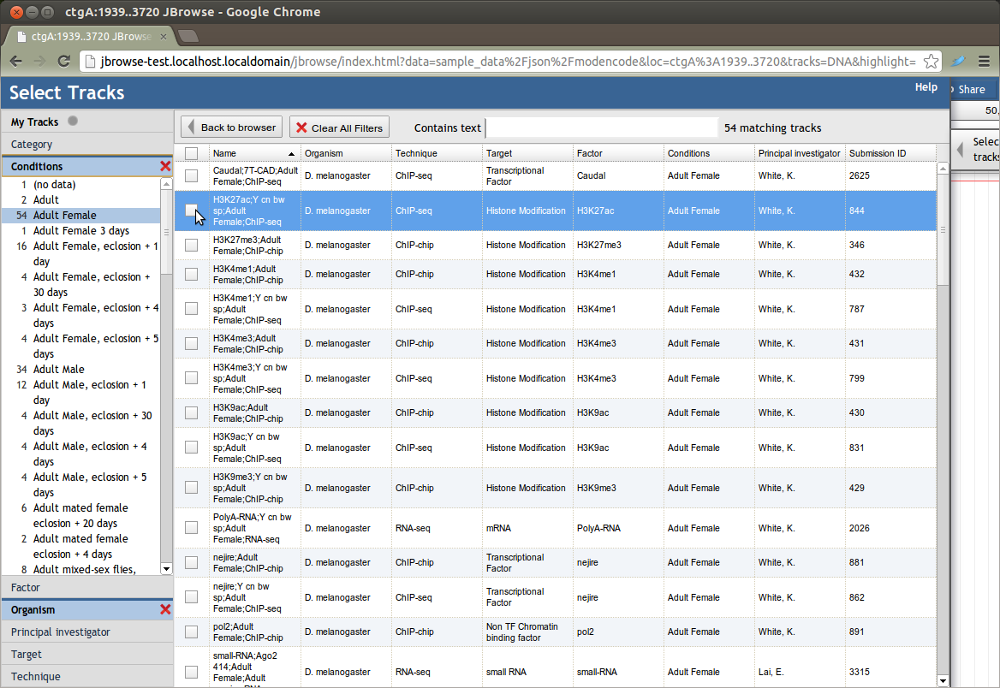

JBrowse supports three track selectors by default currently:

- JBrowse/View/TrackList/Hierarchical - a checkbox oriented track selector with
  hierarchical categories (default)
- JBrowse/View/TrackList/Faceted - a grid oriented track selector with rich
  metadata displayed in a spreadsheet style
- JBrowse/View/TrackList/Simple - track selector with "a drag and drop tracks
  into the view" oriented mode of operation, considered "legacy" by now :)

## Faceted Track Selector

Starting with version 1.4.0, JBrowse has an optional "faceted" track selector
designed for sites with hundreds or even thousands of tracks in a single JBrowse
instance. This track selector allows users to interactively search for the
tracks they are interested in based on the metadata for each track.

An example of a faceted track selector in action with about 1,800 tracks can be
seen
[here](http://jbrowse.org/code/JBrowse-1.4.0-full/index.html?data=sample_data/json/modencode).
This is an example installation containing a snapshot of modENCODE track
metadata. Note that the track data and reference sequences in this example are
not real (they are actually all just copies of the same volvox test track), this
is just an example of the faceted track selector in action.

The `Faceted` track selector takes all sources of track metadata, aggregates
them, and makes the tracks searchable using this metadata. By default, tracks
only have a few default metadata facets that come from the track configuration
itself. After initially turning on the faceted track selector, most users will
want to add their own metadata for the tracks: see
[Defining Track Metadata](#defining-track-metadata 'wikilink') below. To enable
the faceted track selector in the JBrowse configuration, set
`trackSelector→type` to `Faceted`.

There are some other configuration variables that can be used to customize the
display of the track selector. Most users will want to set both of these
variables to customize the columns and facets shown in the track selector.

| Option                            | Value                                                                                                                                                                                                                                                    |
| --------------------------------- | -------------------------------------------------------------------------------------------------------------------------------------------------------------------------------------------------------------------------------------------------------- |
| `trackSelector→displayColumns`    | Array of which facets should be displayed as columns in the track list. Columns are displayed in the order given. If not provided, all facets will be displayed as columns, in lexical order.                                                            |
| `trackSelector→renameFacets`      | Object containing "display names" for some or all of the facet names. For example, setting this to `{ "developmental-stage": "Dev. Stage" }` would display "Dev. Stage" as the name of the `developmental-stage` facet.                                  |
| `trackSelector→escapeHTMLInData`  | Beginning in JBrowse 1.6.5, if this is set to `true` or `1` prevents HTML code that may be present in the track metadata from being rendered. Instead, the HTML code itself will be shown.                                                               |
| `trackSelector→selectableFacets`  | Optional array of which facets should be displayed as facet selectors. The selectors for these appear in the order in which they are specified here. \*Note: the names of the facets are required to be in all lower case for selectableFacets to work\* |
| `trackSelector→initialSortColumn` | A column specifying how the faceted selector is initially sorted. This parameter should be the name used in the displayColumns array and not the "renamed" facet column name.                                                                            |

## Example Faceted Track Selector Configuration

To use the Faceted track selector, you might add something like this to
jbrowse_conf.json (or trackList.json, but store it outside the "tracks": []
section)

    "trackSelector": {
        "type": "Faceted",
        "displayColumns": [
            "key",
            "organism",
            "technique",
            "target",
            "factor",
            "developmental-stage",
            "principal_investigator",
            "submission"
        ],
        "renameFacets": { "developmental-stage": "Conditions", "submission": "Submission ID" },
        "selectableFacets": ["organism","technique","developmental-stage","factor"]
    }

## Hierarchical Track Selector

Starting with version 1.11.0, JBrowse uses a "Hierarchical" track selector by
default that is designed to allow grouping of tracks and easy checkbox selection
choices. The Hierarchical track selector is like the old Simple track selector
(which was the default), except it pays attention to the “category” key in a
track’s metadata, and if it is present, it organizes the tracks into nested,
collapsible panes based on that. Also, instead of the drag-and-drop paradigm
used by the Simple track selector, the Hierarchical track selector turns tracks
on and off by just checking and unchecking the box next to each track. For more
information, see [1](http://jbrowse.org/jbrowse-1-11-0/)

To assign categories and subcategories to your tracks, set category or
metadata.category attributes on each configured tracks in your trackList.json.
Starting in JBrowse 1.11.5, the category can also be read from a
trackMetadata.csv category columns.

There are some other configuration variables that can be used to customize the
display of the Hierarchical track selector.

| Option                              | Value                                                                                                                                                                                                                                                                                                                                                           |
| ----------------------------------- | --------------------------------------------------------------------------------------------------------------------------------------------------------------------------------------------------------------------------------------------------------------------------------------------------------------------------------------------------------------- |
| `trackSelector→sortHierarchical`    | Can be true or false. If true, categories and tracks are sorted in alphabetical order. If false, tracks will be loaded specifically in the order that they are specified in the tracklist configuration files. Default:true. Added in JBrowse 1.11.5                                                                                                            |
| `trackSelector→collapsedCategories` | A comma separated list of categories from the trackList that will be collapsed initially. This helps when many tracks are loaded in the trackList but you want to collapse certain categories when the user first loads. If there are subcategories specified using slashes. Added in JBrowse 1.11.5                                                            |
| `trackSelector→categoryOrder`       | A comma separated list of categories which specifies their order. Note that if the there are nested subcategories e.g. the Quantitative/Density in the volvox example, then you can specify a subcategory and it makes the whole Quantitative section sort to the top. Example: categoryOrder=VCF,Transcripts,Quantitative/Density,BAM. Added in JBrowse 1.15.4 |
